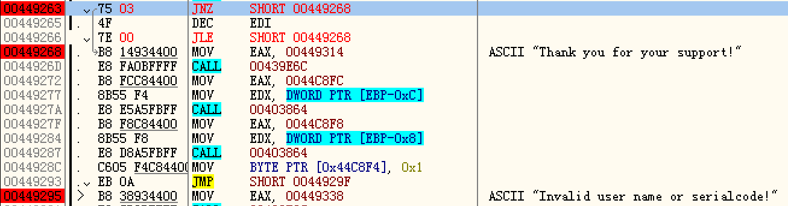

# Lab Report : Tris Lab

## Problem 1

It can be solved by modifying the target address for direct jump instructions.

## Problem 2

It can be solved by a pintools which modifying the target address in eip register for certain direct jump instructions. For more details, please refer to [pintool.cpp](pintool.cpp).