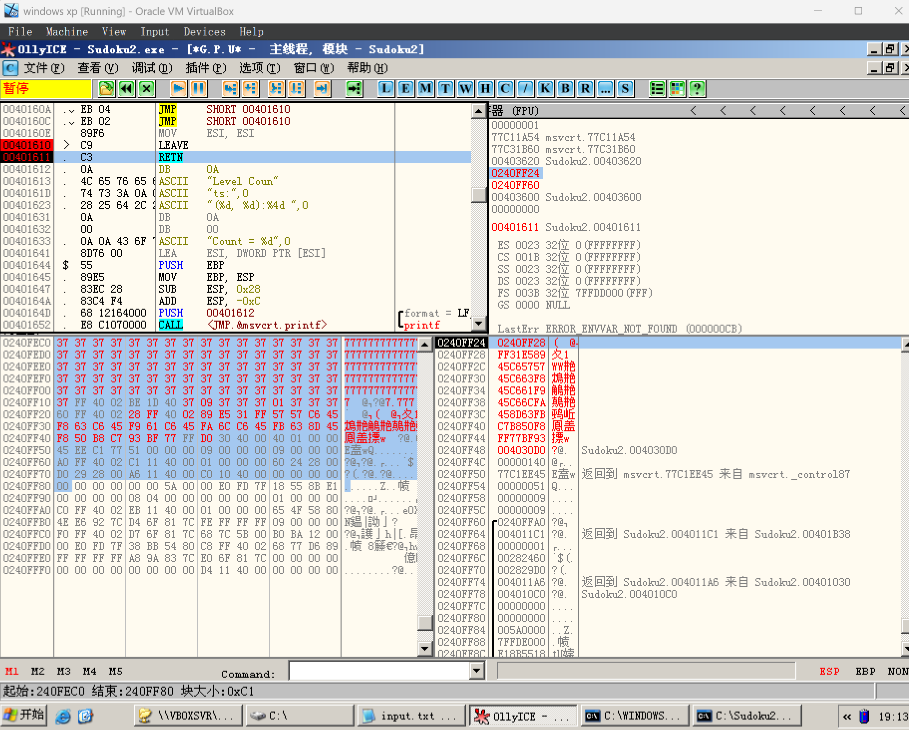

# Lab Report : Soduku Exploit

## Solution

I follow the instruction from class to construct an attacking input based on stack overflow. 

As the result for this lab, I can use OllyICE to do the exploitation. But if I run ".\Soduku2.exe < shellcode.bin", the exploit won't work. I think it's related to the truncation logic of scanf.

As the screenshots below shows, I replace the data on the stack with my input, and we will hijack the control flow (by overwriting the return address on the stack) to `0x0240FF28` and run our shellcode, which will launch the calculator.

The python script for generating the exploit input is located at [generate_exploit.py](generate_exploit.py). And my binary exploit is located at [shellcode.bin](shellcode.bin).

## Result Screenshots

