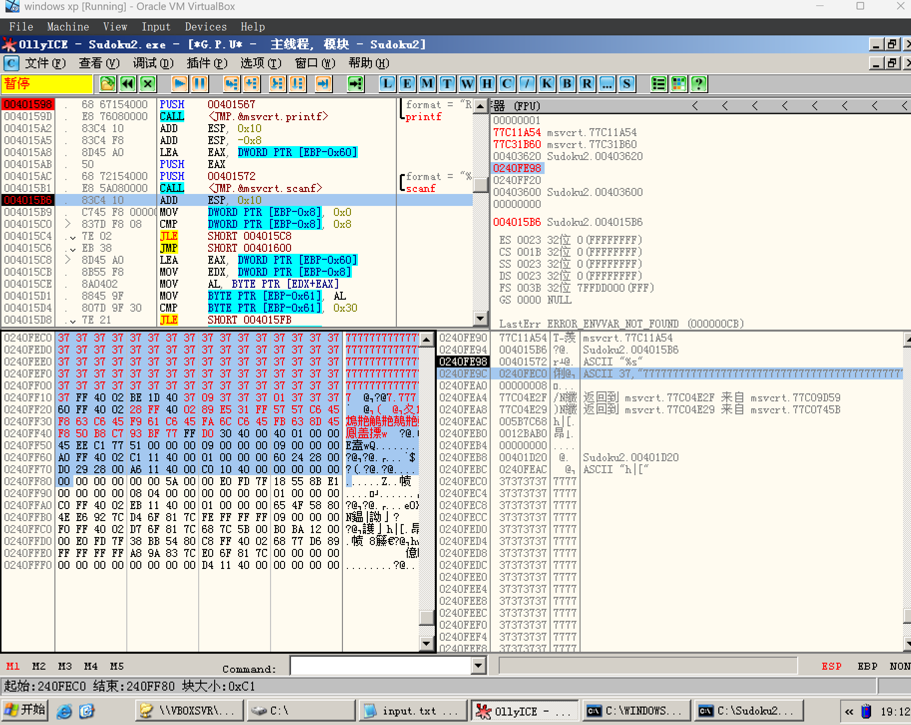

# Lab Report : Soduku Exploit

## Solution

I follow the instruction from class to construct an attacking input based on stack overflow. 

As the result for this lab, I can use OllyICE to do the exploitation. But if I run ".\Soduku2.exe < shellcode.bin", the exploit won't work. I think it's related to the truncation logic of scanf.

As the screenshots below shows, I replace the data on the stack with my input, and we will hijack the control flow (by overwriting the return address on the stack) to `0x0240FF28` and run our shellcode, which will launch the calculator.

The python script for generating the exploit input is located at [generate_exploit.py](generate_exploit.py). And my binary exploit is located at [shellcode.bin](shellcode.bin).

## Result Screenshots




## Documentation for Exploit Code

The exploit code is generated by

```python
# Write binary format to file
with open('shellcode.bin', 'wb') as f:
    f.write(bytes([0x37] * 80)) # 80 dummy bytes
    # Write the additional values in little-endian format
    f.write(bytes.fromhex('37FF4002'))  # 0240FF37
    f.write(bytes.fromhex('BE1D4037'))  # 37401DBE
    f.write(bytes.fromhex('37373737'))  # 37373737
    f.write(bytes.fromhex('37373737'))  # 37373737
    f.write(bytes.fromhex('60FF4002'))  # 0240FF60
    f.write(bytes.fromhex('28FF4002'))  # 0240FF28 KEY!!!
    f.write(shellcode_bytes)
```

Notice that ASLR is not enabled on the virtual machine environment. 

And we first need to choose a dumb byte. The byte we choose must avoid:

1. `\x00` as the end of the string

2. `\n`, `\t`, etc. which will stop scanf from scanning further

And I just choose `\x37` (ASCII '7').

Here's how I generate the exploit input:

I generate 80 dumb bytes to fill the buffer. Then due to the observation of the stack layout, we need to fill 20 bytes of original information. (By "original", I mean I will collect the original stack information and form my exploit. And I will replace invalid bytes (such as `\x00`) with `0x37`). Then I overwrite the return address on the stack to `0x0240FF28`, which is just the address beneath it. At last I fill the exploit input with my shellcode. In this way, when the function returns, it will return to `0x0240FF28` and will execute our shellcode.

## Acknowledgements

Thanks to my classmate Zhehan Lei for sharing the shellcode, which will launch the calculator on Windows XP system.

