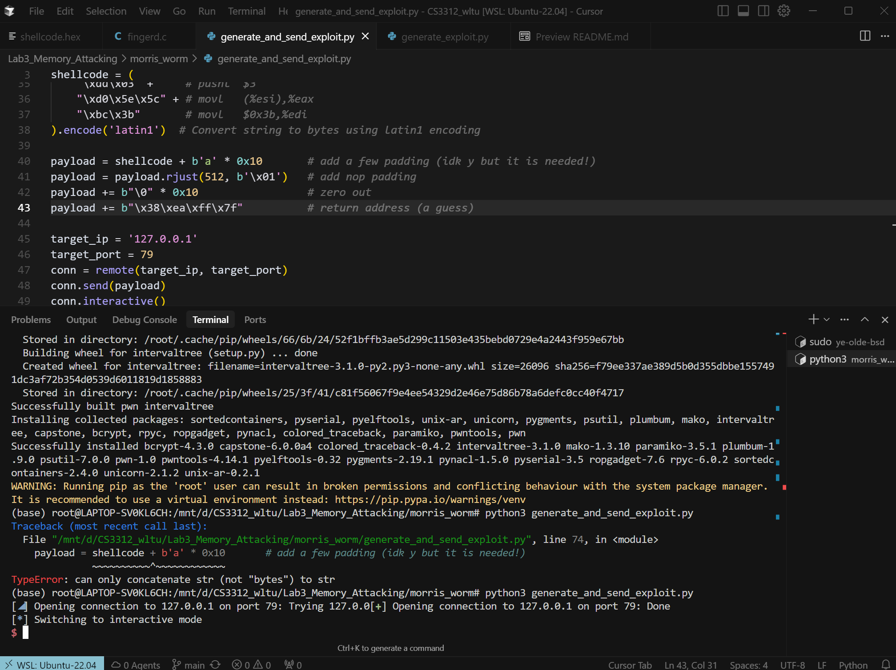

# Lab Report : Morris Worm

## Solution

Thanks for the detailed guide written by the TA. I just follow the guide to configure the VAX environment on my WSL, and write the python script [generate_and_send_exploit.py](generate_and_send_exploit.py) to hijack the control flow and run our shellcode (making use of the stack overflow and overwrite the return address).

## Result Screenshots



## Documentation for Exploit Code

The exploit input is generated by

```python
payload = shellcode + b'a' * 0x10       # add a few padding (idk y but it is needed!)
payload = payload.rjust(512, b'\x01')   # add nop padding
payload += b"\0" * 0x10                 # zero out
payload += b"\x38\xea\xff\x7f"          # return address (a guess)
```

Here's the explaination:

Since the address of the stack can change, we use a technique called NOP Sled, where we insert a bunch of `nop` instruction before the shellcode. Then we don't need to jump to the accurate address of the shellcode. We can just choose a likely address (`0x7fffea38`) and jump there. After executing some `nop` instructions, CPU will execute our shellcode.
