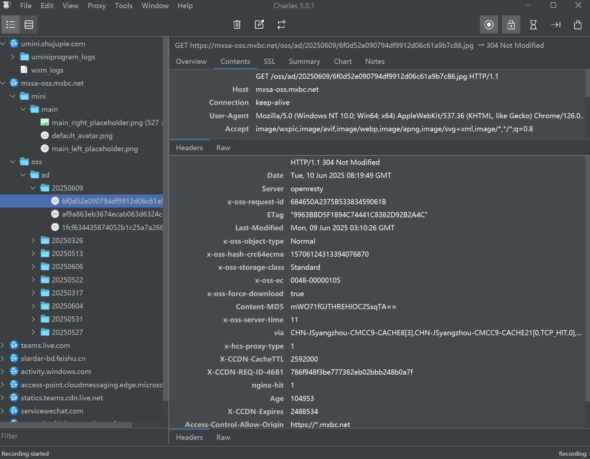
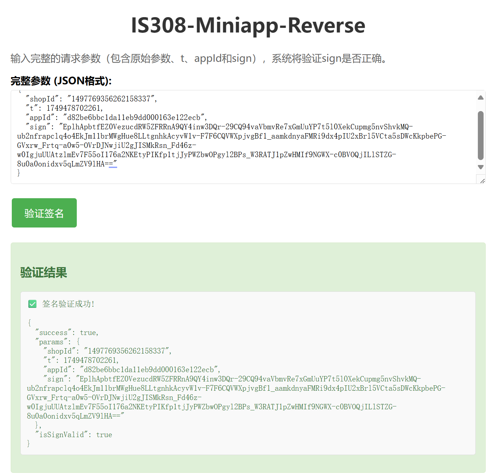

# Lab Report : APP Attacking

## Result Screenshots

1. Successfully capture the packets:



2. Successfully reverse the sign generating algorithm:



## Solution

For packet capture, I use "Charles Proxy" software and follow this guide: [https://www.zhihu.com/tardis/zm/art/1896701961547538943?source_id=1005](https://www.zhihu.com/tardis/zm/art/1896701961547538943?source_id=1005).

And in order to reverse the sign generating algorithm, I depack the APP program following this guide : https://www.52pojie.cn/thread-2023369-1-1.html[](https://www.52pojie.cn/thread-2023369-1-1.html), and locate the logic of generating the sign.

```js
function l() {
  return (l = n(e().mark((fu
  nction n(i) {
    var u, o, s, l, f, b, d;
    return e().wrap((function(e) {
      for (;;) switch (e.prev = e.next) {
        case 0:
          // 1. Initialize empty string for concatenation
          for (u = "", 
          // 2. Add timestamp and appId to input parameters
          o = t(t({}, i), {}, {
              t: Date.now() - (getApp().configData.timeOffset || 0),
              appId: c
            }), 
          // 3. Sort parameters alphabetically
          s = Object.keys(o).sort(), 
          l = 0; l < s.length; l++) 
            f = s[l], 
            // 4. Process each parameter
            o[f] || 0 === o[f] ? (
              // Convert objects to JSON strings, keep other values as is
              b = "object" === r(o[f]) ? JSON.stringify(o[f]) : o[f], 
              // Concatenate with & if not first parameter
              u += "".concat(l ? "&" : "").concat(f, "=").concat(b)
            ) : "" !== o[f] && delete o[f];
          
          // 5. Call RSA signing function
          return e.next = 6, (0, a.default)(u, p);
        case 6:
          // 6. Process the signed result
          return d = e.sent, e.abrupt("return", t(t({}, o), {}, {
            sign: d.replace(/\//g, "_").replace(/\+/g, "-")
          }));
        case 8:
        case "end":
          return e.stop()
      }
    }), n)
  })))).apply(this, arguments)
}
```

Then I write a python script for automatically generating the request message : [generate_sign.py](generate_sign.py).

## My Request Message

```
{
  "shopId": "1497769356262158337",
  "t": 1749478702261,
  "appId": "d82be6bbc1da11eb9dd000163e122ecb",
  "sign": "EplhApbtfEZ0VezucdRW5ZFRRnA9QY4inw3DQr-29CQ94vaVbmvRe7xGmUuYP7t5l0XekCupmg5nvShvkMQ-ub2nfrapclq4o4EkJm11brMWgHue8LLtgnhkAcyvW1v-F7F6CQVWXpjvgBf1_aamkdnyaFMRi9dx4pIU2xBrl5VCta5sDWcKkpbePG-GVxrw_Frtq-a0w5-OVrDJNwjiU2gJISMkRsn_Fd46z-w0IgjuUUAtzlmEv7F55oI176a2NKEtyPIKfp1tjJyPWZbwOPgyl2BPs_W3RATJ1pZwHMIf9NGWX-c0BVOQjILlSTZG-8u0a0onidxv5qLmZV9lHA=="
}
```